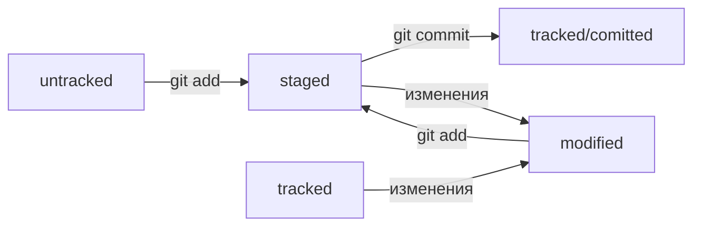

## Установка
### Linux
Для установки Git на Linux нужно использовать терминал. Найди программу Terminal в поиске или в списке программ. Перейди на официальный сайт Git и выберите команду установки для своей версии Linux. Скопируйте её в программу Terminal и нажмите Enter. 

### Windows
Для установки на Windows надо скачать дистрибутив [по ссылке](https://git-scm.com/download/win)

## Команды git
$ git version - если Git установлен правильно, консоль выведет его текущую версию. 
$ git config --list - вывод конфигурации git(глобальные настройки)

В качестве значения user.name нужно указать своё имя или никнейм. 
Для настройки параметра user.email указывают электронную почту.

$ git config --global user.name "User Namovich" имя или ник нужно написать латиницей и в кавычках
$ git config --global user.email username@yandex.ru здесь нужно указать свой настоящий email 

## Создание локального репозитория
В каталоге отведенном для файлов репозитория выполняем команду $ git init

Если ты случайно сделал Git-репозиторием не ту папку, её можно «разгитить». 
Для этого нужно удалить скрытую подпапку .git. $rm -rf .git

$ git status - показывает текущее состояние репозитория. 
$ git add - подготовить файл к сохранению
$ git add --all - подготовить все файлы в директории к сохранению
$ git add . - Также можно добавить текущую папку целиком — в этом случае все файлы в ней тоже будут добавлены. 
$ git commit -m 'Мой первый коммит' - коммит с комментарием "Мой первый коммит"
$ git log - просмотреть историю коммитов

## Настройка ssh
$ ssh-keygen -t ed25519 - C "user@mail.com" генерация приватного и публичного ключей ssh
$ eval "$(ssh-agent -s)" - запуск агента для слежения за ключами ssh
$ ssh-add ~/.ssh/id_ed25529 добавление агенту приватного ключа

## Команды для работы с удаленным репозиторием
$ git remote add - gривязать удалённый репозиторий к локальному, например $ git remote add origin git@github.com:%ИМЯ_АККАУНТА%/first-project.git 
origin (англ. «источник») — стандартный псевдоним, с помощью которого можно обращаться к главному удалённому репозиторию (обычно такой репозиторий один). Это значительно упрощает работу.
$ git remote -v - чтобы убедиться, что репозитории связаны
$ git push - Отправить изменения на удалённый репозиторий. В первый раз эту команду нужно вызвать с флагом -u и параметрами origin (имя удалённого репозитория) и main или master (название текущей ветки), например $ git push -u origin main

### Клонирование репозиториев
$ git clone https://github.com/yandex-praktikum/git-clone-lesson - команда git clone автоматически связывает локальный и удалённый репозитории. То есть если в GitHub-репозитории что-то поменяется (например, добавятся коммиты), вам не нужно будет заново клонировать его. Достаточно будет выполнить команду, которая обновит вашу копию.
##Хеш и HEAD
###Хеш коммита
Основной идентификатор коммита — это его хеш.
Информация о коммите — это набор данных: когда был сделан коммит, содержимое файлов в репозитории на момент коммита и ссылка на предыдущий, или родительский (англ. parent), коммит. Git хеширует (преобразует) эту информацию с помощью алгоритма SHA-1 (от англ. Secure Hash Algorithm — «безопасный алгоритм хеширования») и получает для каждого коммита свой уникальный хеш — результат хеширования.
Git — символьная строка. Она относительно коротка (40 символов в случае SHA-1) 
если хеш получить дважды для одного и того же набора входных данных, то результат будет гарантированно одинаковый;
если хоть что-то в исходных данных поменяется (хотя бы один символ), то хеш тоже изменится (причём сильно).
Git хранит всю свою служебную информацию в этой папке, в том числе и таблицу, в которой можно найти коммит по хешу.
После вызова $ git log появляется список коммитов с их описанием.
Вот из каких элементов состоит описание:
1. Строка из цифр и латинских букв после слова commit — это уже знакомый вам хеш коммита.
2. Author — имя автора и его электронная почта.
3. Date — дата и время создания коммита.
4. Сообщение к коммиту.
Сокращённый лог вызывают командой $ git log с флагом --oneline (англ. «одной строкой»). При этом в терминале появятся только первые несколько символов хеша каждого коммита и комментарии к ним.
###HEAD
При вызове команды git log можно заметить надпись (HEAD -> master) после хеша одного из коммитов.
Файл HEAD (англ. «голова», «головной») — один из служебных файлов папки .git. Он указывает на коммит, который сделан последним (то есть на самый новый).
Это синоним хеша последнего коммита — его можно передавать командам Git в качестве параметра.
##Статусы файлов. Как читать git status
###Статусы файлов
Для файлов в состояниях staged и modified обычно не указывается, что они также tracked, потому что это состояние подразумевается.
Файл, попавший в staged, автоматически становится tracked.

###Как читать git status

